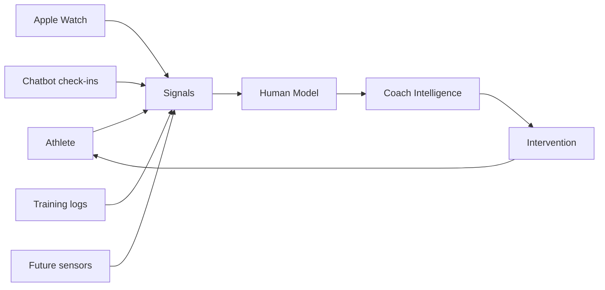

# The Human Model

The Human Model is an independent human-performance systems project: a working attempt to measure recovery, behavior, training, and movement quality, then turn those signals into useful feedback loops.

The short version: I am building an n=1 performance lab that starts with real daily data and grows toward a personalized model of human capability.

Portfolio page: [The Human Model](https://hallowed-seat-b6b.notion.site/The-Human-Model-382cf4d8ba1880a188dbc6a664b5a7cc)

```text
measure -> model -> optimize -> adapt
```

## Current Status

This is an early-stage research and engineering project, not a finished product. The current milestone is turning the data spine into a usable coach-style feedback loop: reliable capture, structured records, Bridget as the daily delivery surface, local dashboarding for deeper review, and a transparent baseline readiness model that can be audited before it becomes a recommendation engine.

Implemented so far:

- Main project repo with Recovery Tracking V1 schema, weekly review template, and chatbot logging contract
- Telegram chatbot powered by a local Ollama model
- Natural-language recovery check-in parsing and Notion upserts
- Apple Health import for sleep, HRV, resting heart rate, and weight
- Scheduled morning check-ins through macOS `launchd`
- Guardrails for missing or suspicious Apple Watch sleep data
- Zenfit screenshot OCR/import workflow for workouts, weekly coach check-ins, and body measurements
- Telegram workout logging path with tests, including copy-forward logging, per-set weights, qualitative loads, and notes
- Bridget daily card V1 for a chat-delivered morning summary
- Planned-workout logging so Bridget can reuse expected training context instead of making the user retype the whole workout
- Local Coach Dashboard V1 app in the foundation repo, using FastAPI, SQLite, and a Next.js frontend
- Dashboard data audit and source mapping across recovery, readiness, training entries, body metrics, notes, reviews, import runs, and sync events
- Standalone readiness-modeling layer in the foundation repo that builds daily features, scores against personal baselines, emits reportable readiness bands, and keeps model decisions separate from LLM explanation
- Apple Watch workout and active-energy import for training-output context, plus a dashboard review comparing readiness calls with actual movement output

Recent branch/in-progress work reviewed but not presented as stable release state:

- Body-measurement progress charts on the active dashboard branch
- Structured dashboard backfill for Apple Health and training-plan data
- Training-session summaries for volume, muscle groups, parse warnings, and review needs
- A Bridget daily-card guard that waits for sleep data before sending automatic image summaries

Current focus:

- Keep the recovery loop reliable in real daily use
- Review patterns across Apple Watch metrics, subjective check-ins, and training context
- Keep Bridget useful as the low-friction daily surface
- Make the local dashboard useful as the weekly/deeper review surface
- Connect readiness, training context, and data freshness without overstating recommendation quality
- Prepare the next movement-quality prototype around IMU or output-sensing experiments

## Project Repositories

### Human Model

The foundation repo for schemas, durable project docs, data contracts, review workflows, experiment design, and future analysis artifacts.

Repository: [haleyparks329/human-model](https://github.com/haleyparks329/human-model)

Notable work:

- Recovery Tracking V1 schema
- Chatbot Logging Contract V1
- Weekly Review V1
- Local Coach Dashboard V1: FastAPI/SQLite backend, Next.js frontend, Notion sync/backfill paths, and readiness data model
- Baseline readiness-modeling layer: daily feature generation, transparent heuristic scoring, report generation, tests, and a standalone dashboard page
- Readiness vs Actual training-output review using Apple Watch workout duration/type, active energy, model output, and recent alignment labels
- Active dashboard branch work for body-measurement trend charts and structured training-session summaries
- Project structure for research, experiments, dashboards, notebooks, hardware notes, and data definitions

### Human Model Chatbot

The implementation repo for the conversational logging and automation layer.

Repository: [haleyparks329/human-model-chatbot](https://github.com/haleyparks329/human-model-chatbot)

Notable work:

- Python Telegram bot with local LLM support through Ollama
- Recovery check-in parser and Notion writer
- Apple Health importer using Health Auto Export data
- Morning check-in one-shot service with duplicate prevention
- Zenfit OCR pipeline and Notion sync
- Workout logging from Telegram messages
- Copy-forward workout logging for stable training templates
- Flexible workout parsing for per-set weights, non-numeric loads, workout notes, and month-name dates
- Bridget rhythm prompts, preference calibration, daily card generation, and planned-workout follow-up logic
- Unit tests for parser, scheduling, and data edge cases

## System Concept

The long-term idea is not only to track fitness data. It is to build a personalized model that can learn how one person recovers, executes movement, responds to training, and benefits from feedback.



## Why This Project Exists

Most trackers tell people what happened. The more interesting question is what decision should change because of it.

This project explores that gap by combining software, data modeling, human-centered product thinking, and future sensing systems. Bodybuilding and self-tracking are the test environment because they provide repeated movements, measurable load, adaptation cycles, and clear recovery constraints.

The broader direction reaches into sports performance, physical therapy, rehabilitation, assistive technology, and human-machine interaction.

## Documentation

- [Vision](docs/vision.md)
- [Architecture](docs/architecture.md)
- [Implementation Progress](docs/implementation-progress.md)
- [Coach Dashboard V1](docs/coach-dashboard-v1.md)
- [Telegram Chatbot Evolution](docs/chatbot-telegram-evolution.md)
- [Project Evolution](docs/project-evolution.md)
- [Recovery Modeling](docs/recovery-modeling.md)
- [Movement Analysis](docs/movement-analysis.md)
- [Sensing Systems](docs/sensing-systems.md)
- [Roadmap](docs/roadmap.md)
- [Research Notes](docs/research-notes.md)
- [Source Context](docs/source-context.md)

## Public Code Examples

This repo includes small, sanitized examples extracted from the private working system:

- [Readiness scoring demo](examples/readiness_scoring_demo.py)
- [Readiness modeling demo](examples/readiness_modeling_demo.py)
- [Bridget prompt demo](examples/bridget_prompt_demo.py)
- [Daily card demo](examples/daily_card_demo.py)
- [Dashboard data-shaping demo](examples/dashboard_data_shaping_demo.py)

The examples use mock data and omit private Notion IDs, health records, secrets, and local automation details. See [examples/README.md](examples/README.md) for how to run them.

## What This Demonstrates

- Turning an ambiguous product/research idea into executable milestones
- Building local automation around real personal workflows
- Designing schemas and data contracts before advanced modeling
- Integrating Telegram, Notion, Apple Health exports, OCR, and macOS services
- Thinking across software, sensing, biomechanics, coaching, and human feedback systems

Some implementation details depend on private Notion databases and local health data. This public repo is the readable overview layer.
