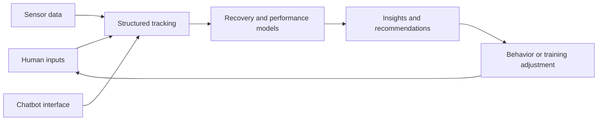

# The Human Model

Modeling human performance through data, biomechanics, and adaptive systems.

The Human Model is an independent research and experimentation project exploring how human performance, recovery, movement quality, and adaptive feedback systems can be measured and improved over time.

The project combines self-tracking, systems thinking, data analysis, AI-assisted interfaces, and early hardware/sensing concepts. It is currently structured as a public overview hub supported by two active development repositories: the main Human Model foundation repo and the Human Model Chatbot repo.

## Current Status

This is an early-stage research and development project. The current goal is not to present a finished product, but to document a thoughtful technical exploration as it moves from concept to working systems.

Current work is focused on:

- Defining the core tracking schemas for recovery, training, body metrics, and experiments
- Building a natural-language logging assistant for structured self-tracking
- Creating a minimum data contract between the chatbot and tracking databases
- Designing future sensing and movement-quality prototypes
- Organizing the project into a clear public technical narrative

## Project Repositories

### Human Model

The main project foundation for schemas, research notes, tracking workflows, experiment design, and system architecture.

Current focus:

- Recovery Tracking V1 schema
- Body metrics tracking schema
- Experiment tracking schema
- Weekly review template
- Minimum data contract for chatbot logging
- Project documentation and knowledge organization

Repository: [haleyparks329/human-model](https://github.com/haleyparks329/human-model)

### Human Model Chatbot

A Telegram-based chatbot that uses a local Ollama model to support training, recovery, biomechanics, habits, movement quality, and human-performance reflection.

Current implementation:

- Python backend
- Telegram bot interface
- Local Ollama model integration
- Environment-based configuration
- macOS launchd service notes for always-on local use

Current sprint direction:

- Parse natural-language recovery check-ins into structured fields
- Connect parsed recovery entries to a Notion recovery database
- Support the first closed loop: check-in -> structured record -> reviewable trend

Repository: [haleyparks329/human-model-chatbot](https://github.com/haleyparks329/human-model-chatbot)

## Current Focus Areas

- Recovery and readiness modeling
- Movement quality analysis
- Closed-loop intervention systems
- Biomechanics and sensing systems
- Human-machine interaction
- Longitudinal n=1 performance tracking

## System Concept

The long-term idea is to treat the body as a dynamic system:

```text
measure -> model -> optimize -> adapt
```

The project starts with structured observation and logging, then builds toward analytics, feedback loops, and sensor-driven movement analysis.



## Documentation

- [Vision](docs/vision.md)
- [Architecture](docs/architecture.md)
- [Recovery Modeling](docs/recovery-modeling.md)
- [Movement Analysis](docs/movement-analysis.md)
- [Sensing Systems](docs/sensing-systems.md)
- [Roadmap](docs/roadmap.md)
- [Research Notes](docs/research-notes.md)
- [Source Context](docs/source-context.md)

## Why This Project Exists

I am interested in data when it helps people better understand themselves, improve their lives, and expand what they are capable of.

The Human Model is a place to explore that idea technically: how to capture meaningful human signals, turn them into useful models, and eventually create adaptive systems that support better recovery, movement, and performance decisions.

## What This Project Demonstrates

This repo is intended to show:

- Independent technical initiative
- Systems thinking
- Human-centered product reasoning
- Ability to organize ambiguous ideas into executable milestones
- Interest in AI, data, sensing, and human-performance technology
- Early experience connecting software systems to real-world physical behavior

The implementation repos and planning links may be private. This public repo is the readable overview layer.
