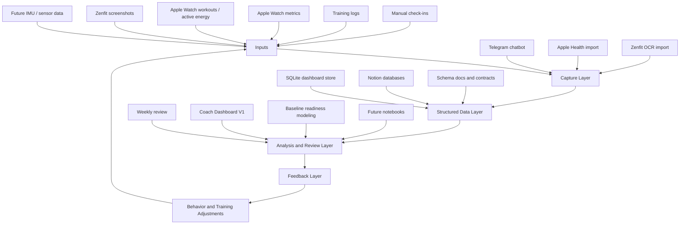

# Architecture

The Human Model is organized as a layered system.



## Repository Roles

### `human-model`

The foundation repo defines the source-of-truth project structure.

It is responsible for:

- Tracking schemas
- Data contracts
- Weekly review workflows
- Experiment design
- Research notes
- Future notebooks, dashboards, and hardware notes

The repo now also contains the first local Coach Dashboard V1 app and a standalone readiness-modeling layer. For the dashboard, SQLite is the canonical local store and Notion is treated as a mirror, review, and selected manual-input layer. The modeling layer builds daily features, scores a transparent baseline model, and writes reviewable outputs before any LLM explanation layer touches the result.

### `human-model-chatbot`

The chatbot repo is the capture and automation layer.

It is responsible for:

- Accepting natural-language Telegram inputs
- Calling a local LLM through Ollama
- Parsing structured recovery and workout logs
- Writing recovery entries to Notion
- Importing Apple Health exports into daily recovery rows
- Importing Apple Watch workouts and active energy as training-output context
- OCR/importing Zenfit screenshots into structured Notion databases
- Running local scheduled jobs through macOS `launchd`
- Supporting Telegram workout logging, copy-forward templates, flexible load parsing, workout notes, and Bridget daily cards
- Locally integrating Coach Dashboard V1 readiness and daily-card guard behavior in the working tree

### `the-human-model-overview`

This repo is the public narrative layer. It explains the system, implementation progress, roadmap, and product/research reasoning without exposing private health data or Notion database contents.

## Current Technical Stack

- Python
- Telegram bot API
- Ollama running a local model
- Notion as the early database and review layer
- SQLite as the local canonical store for Coach Dashboard V1
- FastAPI backend for the local dashboard
- Next.js frontend for the local dashboard UI
- Transparent readiness-modeling scripts for feature generation, baseline scoring, and report output
- Health Auto Export for Apple Health JSON exports
- Apple Vision/OCR flow through the Zenfit importer
- macOS `launchd` for local scheduled automation
- GitHub issues and repos for implementation planning
- Future analytics stack: pandas, NumPy, matplotlib, Plotly, scikit-learn, Jupyter, Streamlit
- Future sensing stack: Arduino, IMU sensors, force sensors, possible EMG experiments

## First Working Loops

### Recovery Loop

```text
Apple Watch metrics + Telegram check-in
-> daily Recovery Tracking V1 row
-> weekly review
-> next training / recovery adjustment
```

### Training Context Loop

```text
Zenfit screenshots or Telegram workout log
-> OCR / parser / structured workout fields
-> Notion training log
-> future comparison against recovery and performance trends
```

### Local Dashboard Loop

```text
Notion / Telegram / Health exports / app entry
-> SQLite dashboard store
-> readiness result, structured sessions, data-health context, and progression signals
-> coach-style daily review
-> future weekly analysis
```

### Baseline Modeling Loop

```text
SQLite dashboard rows
-> daily recovery/training features
-> transparent baseline readiness score and data-quality notes
-> report and local model dashboard
-> later calibration against actual training outcomes
```

### Bridget Daily Surface

```text
Health sync + readiness context + Bridget state
-> daily card schema
-> chat-friendly image and short prompt
-> one small reply or correction
-> updated context for later review
```

### Readiness vs Actual Review

```text
Baseline readiness call + Apple Watch movement output
-> alignment label
-> recent 14-day review table
-> calibration questions for later model improvement
```

See [Coach Dashboard V1](coach-dashboard-v1.md) for the current local UI screenshots.

These loops give the project a working data spine before advanced modeling or hardware.
